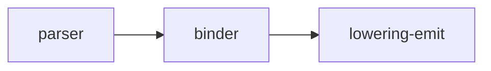
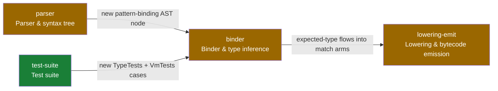

# System recap (visual plan / visual recap)

Produce a high-altitude, visual review aid directly in the PR description. No
deployment, no third-party service: GitHub renders the block (including mermaid
diagrams), and the PR itself is the storage. A future viewer app can ingest the
same marker-delimited block via the GitHub API, so follow the format exactly.

The recap is informational and non-blocking. It supplements the PR description
and normal code review; it never replaces reading the diff.

## Two modes, one format

- **Plan mode** (before/while implementing): describe the intended change
  against the current system. If no PR exists yet, put the block in the plan
  document or message; move it into the PR description once the PR exists.
- **Recap mode** (PR creation and every meaningful update): describe what the
  diff actually does. Replaces a plan-mode block if one exists.

## Source-of-truth rules (non-negotiable)

1. **Recap mode reads the diff, not memory.** Generate the recap from
   `git diff <base>...HEAD` (plus `git diff --stat`) against the PR base branch
   (`main`). Session context may explain intent, but every claim about what
   changed must be checkable against the diff.
2. **Classification uses the primitives taxonomy.** Read
   [`docs/architecture/primitives.yaml`](../../../docs/architecture/primitives.yaml)
   for stable `id` / `name` / `group` values. Prefer the classifier script over
   hand-matching paths:

   ```bash
   node .claude/skills/visual-recap/scripts/classify-primitives.mjs --base <base> --head HEAD
   # or: git diff --name-only <base>...HEAD | node .../classify-primitives.mjs --stdin --json
   ```

3. **The taxonomy is not a feature changelog.** Update `primitives.yaml` only
   when this PR **adds, removes, or materially reshapes** a primitive (new `id`,
   renamed meaning, or code roots that must change) — e.g. adding a new
   compilation stage, splitting the binder into two components, or renaming a
   module. Do **not** edit `summary` for ordinary feature work — a new
   language feature that lives inside the existing binder/parser/emitter is
   still `extends`, not a taxonomy change. After editing the map, run:

   ```bash
   node .claude/skills/visual-recap/scripts/check-primitives-map.mjs
   ```

## Risk classification

Classify each touched primitive, then roll up to the highest severity as the
overall classification (`adds` > `extends` > `composes`):

| Classification | Meaning                                                    | Risk   |
| -------------- | ---------------------------------------------------------- | ------ |
| `composes`     | Uses existing primitives as-is; wiring and call sites only | Low    |
| `extends`      | Changes a primitive's behavior, shape, or contract         | Medium |
| `adds`         | Introduces a new primitive (must update primitives.yaml)   | High   |

A change touching an invariant from `primitives.yaml` (for example
`transpile-sync` or `pncs-is-canonical`) is called out explicitly regardless of
classification — these are the things reviewers most often miss (e.g. a PR
that edits `pncs/src/main/scala/Binder.scala` but forgets to run
`sbt pncs/transpile` and commit the regenerated `pnc/src/Binder.pn`).

The classifier reports which primitives' `code` roots the diff touches; you
still decide `composes` vs `extends` from the diff (and `adds` when you create a
new map entry).

## Block format

The block lives in the PR description between HTML comment markers, wrapped in
`<details>`. Fixed section order — a future ingestion process parses this
structure. Omit optional sections rather than leaving them empty.

````markdown
<!-- system-recap:start -->

<details>
<summary>System recap — <b>extends existing primitives</b> (medium risk)</summary>

**Mode:** recap · **Base:** `main` @ `abc1234` · **Head:** `def5678`

**Classification:** extends — bidirectional inference gains expected-type
propagation into match arms; no new primitives.

### Primitives touched

| Primitive | Group     | Impact                                          |
| --------- | --------- | ------------------------------------------------ |
| `binder`  | semantics | extends — expected-type flows into match arms    |
| `test-suite` | quality | composes — new TypeTests cases                  |

### System map

_One sentence: what this diagram shows and the main path through the change._

**Legend:** green = composes (wiring only) · amber = extended by this PR · red =
new primitive · gray = context (unchanged, included only when an edge crosses
it).


### Change flow

_Optional: a mermaid flowchart or sequence diagram of the specific change._

### Before / after

_Optional: bytecode/AST shape, CLI flag, or diagnostic message changes as
compact before/after fenced blocks or tables._

### Invariants

_Optional: only when the change touches an invariant from primitives.yaml —
e.g. note explicitly that `pnc/src/Binder.pn` was regenerated via
`sbt pncs/transpile` and committed alongside `Binder.scala`._

### Plan vs actual

_Recap mode only, when a plan-mode block existed: what shipped as planned and
what drifted, in a short list._

</details>

<!-- system-recap:end -->
````

Format rules:

- The `<summary>` line always carries the overall classification and risk in
  bold so reviewers see it without expanding.
- Blank line after `<summary>` and around every fenced block, or GitHub will not
  render the markdown/mermaid inside `<details>`.
- **System map**: a PR-scoped **change map** — how touched primitives interact
  _because of this diff_, not the full compiler pipeline. Rules:
  - Open with one sentence naming the main flow (e.g. "Match-expression type
    checking flows from the parser through the binder into the new lowering
    case.").
  - Include the **legend** line (colors and what they mean) directly above the
    diagram, using the fixed wording from the template.
  - Include only primitives the diff touches plus neighbors needed to show a
    crossing edge — not all 13 nodes, and no gray context nodes unless this PR
    actually calls through them.
  - **Label every edge** with what this PR does across that boundary: which
    AST/bound-tree shape crosses it, which opcode or metadata table, which CLI
    flag, which invariant. Unlabeled arrows are forbidden; they read as
    meaningless topology and are the main failure mode reviewers report.
  - Node labels: primitive `id` plus the `name` from `primitives.yaml` on a
    second line via `<br/>` (e.g. `binder["binder<br/>Binder & type inference"]`).
  - Color nodes with the four `classDef` styles (`touched` = composes,
    `extended`, `added`, `untouched` for context-only nodes).
  - Prefer fewer, labeled edges over chaining unlabeled `A --> B --> C` hops.
    Split long chains only when each hop has its own label.
  - Quote node labels containing spaces or special characters.
  - When a sequence diagram already in **Change flow** covers the same path, the
    system map may omit duplicate edges — but still include cross-cutting hops
    (metadata format, transpile output, VM) that the sequence diagram skips.
- Keep the whole block scannable: prefer tables and diagrams over prose, and
  keep it well under ~120 lines.

## Workflow

### Recap mode (PR create/update)

1. Resolve base/head (`gh pr view <n> --json baseRefName,headRefName`).
2. Classify paths:

   ```bash
   node .claude/skills/visual-recap/scripts/classify-primitives.mjs --base <base> --head HEAD --json
   ```

3. Read the full diff for anything you did not author this session; decide
   composes/extends/adds per matched primitive (and note important unmatched
   paths if they introduce a new surface — e.g. a brand-new top-level module
   that doesn't fit any existing `code` root).
4. Author the block following the format above. Use map `name` for diagram
   labels; pull behavioral detail from the diff, not by rewriting map
   summaries.
5. Upsert it into the PR description:

   ```bash
   node .claude/skills/visual-recap/scripts/upsert-recap-block.mjs <pr-number> <block-file>
   ```

   The script replaces the content between the markers, or appends the block to
   the end of the description on first run. It never touches text outside the
   markers.

6. Re-run steps 2-5 after pushing significant new commits to the PR.

### Plan mode

Same steps, except: `**Mode:** plan`, no Base/Head commits required, "Primitives
touched" describes intended impact, and add a one-line note when the plan
requires **no** change to any primitive — that is the lowest-risk outcome and
worth stating explicitly. When implementation later diverges from the plan, the
recap's "Plan vs actual" section records the drift.

## System map example (weak vs strong)

The diagram must explain **this PR's** crossings, not restate the static
pipeline. Compare:

**Weak** (unlabeled topology — reviewers cannot tell what the arrows mean):



**Strong** (intro, legend, human names, labeled edges):

Match-expression type checking flows from the parser's new pattern-binding AST
node through the binder's bidirectional inference into the lowering stage that
emits the branch dispatch.

**Legend:** green = composes · amber = extended by this PR · red = new primitive
· gray = context.



Derive edge labels from the diff (AST/bound-tree shapes, opcodes, metadata
tables, CLI flags, invariants). The **Change flow** sequence diagram can stay
for compilation-pass ordering; the system map answers "which primitives does
this PR connect, and how?"
