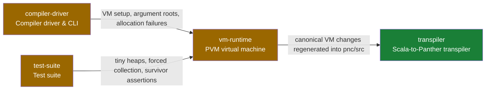

# ADR 0007: Precise garbage collection for the PVM

**Status:** Proposed — design only; no collector implemented
**Date:** 2026-09-11
**Primitives:** `vm-runtime`, `compiler-driver`, `test-suite`, `transpiler`
(see [`primitives.yaml`](../primitives.yaml))
**Roadmap:** [§1.5](../../../ROADMAP.md#15-run-the-stages)

## Decision

Build a synchronous, stop-the-world, non-moving mark-and-sweep collector for
the PVM's `Array[Value]` heap. Collect at managed allocation slow paths, trace
tagged references from the active stack and static fields, and reuse dead
blocks through coalescing free lists. Keep object addresses and existing
bytecode layouts stable. Store allocation boundaries and object/array kinds
in runtime side metadata; do not infer layout from a reference's type token.

The first milestone is a correct, measurable collector that lets Stage 3
reclaim compiler temporaries. Completing Stage 3 at a practical memory limit
is an acceptance test, not a consequence we can promise before measuring the
live set and fragmentation.

## Current constraints

The implementation source of truth is
[`VM.scala`](../../../pncs/src/main/scala/VM.scala),
[`Value.scala`](../../../pncs/src/main/scala/Value.scala), and
[`Metadata.scala`](../../../metadata/src/main/scala/Metadata.scala).

| Current behavior | Consequence for GC |
| --- | --- |
| `VM.alloc` advances `heapp` in a fixed `Array[Value]` | No storage is reclaimed today; capacity is in slots, not bytes. |
| The separate `Heap.scala` holds an `Array[int]` and is not used by `VM` | Adding collection there alone would not fix Stage 3. |
| `Value.Ref(token, address)` is distinct from integers, strings, and booleans | References can be traced exactly without compiler stack maps. |
| Objects store fields at `address + field.index` | Allocation metadata must not shift field offsets. |
| Arrays store length at `address`, elements at `address + 1` | Preserve this layout for `Newarr`, array opcodes, and I/O. |
| Array references carry the element token | Token inspection cannot distinguish an object from an array. |
| Evidence records are mixed `Array[any]` values ([ADR 0006](0006-conditional-givens.md)) | Trace each actual value tag, including dependency references; never treat method-token integers as pointers. |
| Static fields occupy a heap prefix | Reserve that prefix permanently, and scan its values as roots. |
| `methodCall` keeps arguments, saved frame registers, locals, and operands below `sp` | Scan `stack[0 .. sp)` across all frames; saved registers are tagged integers. |
| `Ceq` compares reference type and address ([ADR 0003](0003-equality-on-reference-types.md)) | Live addresses must remain stable under this design. |
| Strings are host strings inside `Value.String` | Panther GC reclaims slots; the host collector reclaims strings after all host references disappear. |

The allocation-site audit finds `Newobj`, `Newarr`, `readAllBytesOp`, and
`runWithArgs`, plus static-prefix reservation in `setupHeap`. All four managed
allocation sites must use the new allocator. No compiler-emitted stack maps,
new opcodes, or serialized PNB metadata are needed for the initial collector.

## Heap representation

Keep the VM's existing heap array and constructor interface initially. Add
collector state owned by the VM, implemented with arrays, integer tags, loops,
and existing result types that the Scala-to-Panther path can represent. Avoid
JVM reflection, weak references, or a host collection containing guest roots.

Let `H` be heap capacity and `S = metadata.statics()`. Validate `0 <= S <= H`,
initialize `[0, S)` to `Value.Uninitialized`, and reserve it outside the dynamic
allocator. Dynamic blocks partition the committed interval `[S, heapp)`;
`[heapp, H)` is an uncommitted bump-allocation tail. References may target only
allocated dynamic block starts, including address zero when `S == 0`.

Use the following side metadata, indexed by heap address:

| Metadata | Meaning |
| --- | --- |
| `blockSize: Array[int]` | Positive physical slot count at each block start; zero at interiors and uncommitted addresses. Includes free blocks. |
| Packed two-bit kind | Free, Object, Array; the fourth value is reserved. Only block-start entries are meaningful. |
| Packed mark bit | Set on discovery, reset after sweep. |
| `markWork: Array[int]` and count | Iterative work stack of discovered block addresses. |
| Free-list bin heads | Size-class lists of reusable blocks; next links are `Value.Int` in the first slot of free blocks. Use `-1` as the end sentinel. |

Objects reserve `max(1, fieldSlotCount)` slots, initialized to Uninitialized.
The minimum gives separate zero-field instances distinct addresses. It also
fixes the current `alloc(0)` aliasing hazard. Arrays reserve `length + 1`,
including empty arrays. Record their kind at allocation, independently of the
token stored in `Value.Ref`. Scan all object slots and only array element slots.
The extra slot of a zero-field object remains Uninitialized and is not a field.

Before implementation, test `getTypeDefSize` against emitted instance-field
indices, static members, the last type in the table, and zero-field types.
Every instance field must satisfy `0 <= index < fieldSlotCount`. The collector
must not compensate for an incorrect object size by scanning adjoining blocks.
Fix any demonstrated layout defect in the owning metadata/emitter primitive
and extend this plan's scope explicitly if necessary.

### Memory overhead

With primitive 32-bit host integer arrays, the size table costs `4H` bytes,
the kind/mark bitmaps about `3H/8`, and the work stack `4C`, where `C` is its
capacity. This excludes the existing heap, boxed `Value` instances, strings,
and host object overhead. At 32 million slots the size table alone is about
128 MB. Do not simply retain Stage 3's current 256M-slot experimental setting.

Grow the work stack outside collection, before committing a new allocation,
so its capacity is always at least the number of allocated blocks. Each block
is queued once; collection therefore requires no work-stack growth. Size-class
heads and bitmaps are reserved during VM initialization. Handle integer
overflow in capacity growth and report controlled allocation failure. A host
out-of-memory failure may still terminate the host; a guest heap limit is not
a total process-memory guarantee.

These byte estimates apply to `pncs` on the JVM. When a transpiled VM runs
inside another PVM, its bookkeeping arrays are ordinary outer-VM allocations
with tagged elements and additional overhead. They are not allocated from the
inner heap they manage. Measure that case separately. Compact descriptor
tables or page-based allocation are follow-up options if side metadata costs
dominate; avoid adding them before measuring this baseline.

## Roots and allocation safepoints

At collection, the complete guest root set is:

1. `stack[0 .. sp)`, including every caller frame and current operands.
2. `heap[0 .. S)`, containing all static fields and cached evidence records.
3. A VM-owned temporary-root array's active prefix, for references held across
   allocating host helpers. Its entries are `Value`, not raw addresses.

Only `Value.Ref` creates an edge. Validate that its address is an allocated
block start before marking. Integers equal to addresses are not roots; type
tokens do not control tracing. Uninitialized values and host strings have no
outgoing guest edges. Invalid references indicate a VM invariant violation;
abort the run without sweeping or reusing storage after an incomplete mark.

Precision here means precise reference identification, not last-use analysis:
a dead source local left in an active frame may retain an object until that
slot is overwritten or the frame returns. Start with this safe over-retention.
Consider compiler-emitted local clearing only if measurements show it blocks
the bootstrap memory target.

Collection runs only before reserving a new managed block. There is no
collection during marking, sweeping, field stores, stack shuffling, or the
interval from reservation through initialization and publication of a new
reference. No write barrier is needed under this single-mutator contract.
Future callbacks, threads, or incremental marking must revise that contract.

| Allocation site | Rooting requirement |
| --- | --- |
| `Newobj` | Constructor arguments remain on the operand stack during allocation. Initialize the block and insert its receiver below arguments before entering the constructor. Constructor allocations then see `this` as a root. |
| `Newarr` | Popping the integer length is safe. Initialize the length and elements, then push the new reference, with no intervening allocation. |
| `readAllBytesOp` | The popped path and host byte buffer contain no guest references. Allocate, fill, and push without another guest allocation. |
| `runWithArgs` | Initialize static roots first; allocate and publish the string array before entering the guest method. |
| Future allocating helper | Keep references on the guest stack or explicitly push them into temporary roots before allocation. Restore the previous root count on every success and error path. |

Temporary-root capacity must be reserved before removing references from the
operand stack. Native helpers may not retain raw guest addresses across
allocations without also retaining a registered reference. The API is scoped
by saving/restoring an integer root count; it need not rely on closures or
host-only scope guards.

Initialize active stack slots to Uninitialized. Change `pop` to clear its
vacated slot after reading it. On return, preserve the return value and saved
registers, clear the discarded frame interval, and publish the result at the
caller's argument base. This prevents unused stack cells from retaining host
strings even though they are excluded from guest root scanning. The top-level
`OkValue` remains in `stack(0)` with `sp == 1`; the initial VM lifecycle is one
run, with no later collection after completion. Resumable VMs or externally
retained results would require explicit root handles.

## Allocation and collection algorithm

Expose managed allocation operations such as `allocateObject(fieldSlots)` and
`allocateArray(length)`, returning `Result[int, string]`. Callers propagate
failure through the VM runtime-error path rather than dereferencing a sentinel
address. Static reservation is separate from these operations. Retire the
untyped `alloc(size)` entry point so future sites cannot omit layout metadata.

Reject negative lengths/sizes before arithmetic. For arrays check
`length <= H - S - 1` before adding one; for every request require a positive
physical size no greater than `H - S`. Use subtraction-based capacity checks
to avoid `heapp + size` overflow. A negative array length is an invalid request,
not an instruction to collect.

Allocation proceeds as follows:

1. Try reusable blocks, then the bump tail. Use logarithmic size bins and
   first fit within candidate bins; inspect actual block sizes within a bin.
2. Split a larger free block exactly. A one-slot remainder is valid because
   its size is out of line and its next link needs one slot. Clear obsolete
   boundary metadata and record the remainder's new boundary.
3. If neither source fits, collect once and retry the same request.
4. If it still does not fit, return an out-of-memory runtime error including
   requested slots, live slots, total available slots, and largest available
   block (including the bump tail). Do not loop collecting an unchanged heap.
5. Before committing a block, ensure work-stack capacity for the new block
   count. Initialize every payload slot, record size/kind, and publish its
   reference without another managed allocation.

Use allocation-failure collection as the default first policy. Add an internal
test switch to collect before every managed allocation and a test-only explicit
collection hook at valid safepoints. Tune proactive thresholds only after
observing collection frequency and live-set size.

Collection is iterative:

```text
collect:
    assert not collecting
    collecting = true
    workCount = 0
    visit every active stack, static, and temporary-root Value
    while workCount > 0:
        address = popWork()
        if kind[address] == Object:
            visit heap[address .. address + blockSize[address])
        else:
            validate array length == blockSize[address] - 1
            visit heap[address + 1 .. address + blockSize[address])
    sweep committed blocks in address order
    collecting = false

visit(value):
    if value is Ref(_, address):
        validate allocated block start
        if not marked[address]:
            marked[address] = true
            pushWork(address)
```

Mark-before-enqueue handles cycles and shared subgraphs. During sweep, retain
marked blocks and clear their marks. Clear every slot of dead blocks to
Uninitialized so host strings and wrappers can be released. Merge adjacent
dead/free blocks, zero obsolete interior boundary entries, and rebuild the
size bins. Return a trailing free region to the bump tail by lowering `heapp`.
Preserve the static prefix. Free-list link integers are never scanned as roots.

The post-collection invariant is that every reachable allocation remains at
the same address, every unmarked allocation has become reusable, and free
blocks plus live blocks partition the committed region without overlap.
Tracing costs are proportional to roots and live payload slots; sweeping and
clearing add work proportional to committed blocks and reclaimed slots.
First-fit allocation can still be linear in the number of candidate free
blocks. Neither pauses nor fragmentation are bounded by this design.

## Access integrity

Reusing addresses makes out-of-bounds writes capable of corrupting a different
live object. As part of integration, validate object/array kind, block-start
address, and field/element bounds before heap access. `Stelem` must never write
the array's length slot; `Stfld` must not target an array header. Validate
`Ldlen`, `Ldelem`, and `writeAllBytesOp` against the same allocation metadata.
The tracer uses recorded size, not an unchecked guest-visible length.

These checks do not change the array reference token representation or solve
the existing array cast/type-test semantics. They establish the memory-safety
boundary needed by collection. A forged reference to a reused address cannot
be detected by address metadata alone; guest bytecode must not be allowed to
manufacture `Value.Ref` from integers.

## Alternatives and limits

| Alternative | Decision for the first collector |
| --- | --- |
| Reference counting | Would require updates at every reference mutation and an additional solution for cycles. |
| Copying or compacting collection | Could reduce fragmentation but requires updating every root/reference, including native temporaries, and changes the allocator more substantially. Stable guest identity is possible, but would require that additional machinery. |
| Generational or incremental collection | Defer barriers, remembered sets, and interleaved marking until allocation/pause measurements justify them. |
| Conservative integer scanning | Unnecessary with `Value` tags and would retain integers that happen to resemble addresses. |
| Rely solely on the JVM GC | The JVM cannot reclaim logical blocks from the still-reachable guest heap array. |

There are no finalizers, weak guest references, pinning API, heap growth, or
concurrent mutators in this proposal. Strings and host I/O buffers remain host
allocations and are outside the guest slot budget. Non-moving collection may
report OOM with enough aggregate free slots if no contiguous block fits. If
Stage 3 still fails, distinguish retained live data from fragmentation before
choosing local clearing, pages, or compaction.

For an external implementation reference, Lua's
[collector source](https://www.lua.org/source/5.4/lgc.c.html) separates marking,
propagation, and sweeping. Panther's proposal uses a simpler synchronous cycle;
its root/layout contracts above come from this repository's VM.

## Implementation sequence and acceptance

1. **Allocation metadata and integrity.** Add block/kind tracking, static
   initialization, minimum-size objects, checked heap accesses, and route all
   allocation sites through typed operations. Verify existing VM semantics
   before enabling reuse.
2. **Rooting and reclamation.** Add temporary roots, stack clearing, iterative
   mark/sweep, coalescing bins, controlled allocation errors, and stress mode.
3. **Regression coverage.** Add direct heap/VM tests and compiled Panther
   programs, using tiny heaps to force multiple collections.
4. **Bootstrap and measurement.** Transpile, build Stage 2, run Stage 3 with
   collection enabled, then select a practical capacity from measured results.

Required correctness cases:

| Case | Acceptance |
| --- | --- |
| Stack-only, caller-local, static-only, and temporary-root reachability | Objects and descendants survive forced allocation collections. |
| Nested constructors with reference arguments | Arguments and partially initialized receivers survive constructor allocations. |
| Cycles, diamonds, and a deep chain | Reachable graphs survive; disconnected cycles are reclaimed; marking does not recurse on the host stack. |
| Reference arrays, nested arrays, mixed evidence arrays | Only actual references keep their targets alive, regardless of element token. |
| Zero-field objects and empty arrays | Distinct live allocations have distinct addresses; both are reclaimable. |
| Dead frames and overwritten roots | Formerly reachable blocks become reusable; inactive stack cells are cleared. |
| Repeated mixed-size allocations | Free blocks split/coalesce correctly, payloads reset, live addresses and equality remain stable. |
| Negative/overflowing sizes, exact fit, full live heap, fragmented heap | No arithmetic wrap, corruption, or repeated-collection loop; controlled errors where allocation cannot succeed. |
| Startup arguments, byte-file reads, array access errors | Native allocation paths participate in GC; invalid accesses cannot corrupt other blocks. |
| Tiny random heap graphs | An independent test graph oracle agrees with the survivor set after explicit collection. |

Record collection count, allocated/reclaimed/live slots, peak live slots,
free-block count, largest free block, and candidate-search work in integer
counters. Measure wall time, pauses, and peak process memory from the host
harness without requiring timing builtins in canonical VM code. Keep telemetry
out of program stdout and emitted images.

Implementation validation includes `sbt pncs/compile`, `sbt test/test`,
`sbt scalafmtCheckAll`, `sbt pncs/transpile`, and the documentation checker.
Commit generated `pnc/src` changes with canonical Scala changes. Then run
`scripts/stage3.ps1`; record the heap limit, host memory, elapsed time, GC
counters, and matching Stage 2/3 image hash. Run allocation-heavy bounded-live
workloads much longer than their heap capacity permits without collection and
verify reuse without monotonically growing retained slots.

The current Stage 3 harness hard-codes 268435456 heap slots. Make that capacity
configurable in the implementation work and compare smaller capacities with
the same input. Set the CI capacity and time budget from a successful measured
run with headroom; re-enable the fixed-point gate only after byte equality and
resource use have both been verified. This ADR does not claim those runs have
occurred.

<!-- system-recap:start -->

<details>
<summary>System recap — <b>extends existing primitives</b> (medium risk)</summary>

**Mode:** plan

**Classification:** extends — add collection within the existing VM primitive.
The implementation is correctness-sensitive despite the taxonomy's medium
risk label. This document itself changes no runtime behavior.

### Primitives touched

| Primitive | Group | Intended impact |
| --- | --- | --- |
| `vm-runtime` | runtime | extends — typed allocation, block metadata, roots, collection, checked accesses |
| `compiler-driver` | tooling | extends — propagate setup/allocation errors at VM entry points as needed |
| `test-suite` | quality | extends — collector and VM stress coverage |
| `transpiler` | tooling | composes — regenerate canonical Scala changes into Panther |

The Stage 3 measurement harness under `tools/stage3/` is also touched; it is
not currently assigned a code root in the taxonomy. No new primitive is
required for this runtime feature, so the taxonomy is unchanged by this ADR.

### System map

VM entry points establish roots, managed allocation triggers collection, and
tests exercise the resulting lifetime contract in canonical and generated code.

**Legend:** green = composes (wiring only) · amber = extended by this PR · red =
new primitive · gray = context (unchanged, included only when an edge crosses
it).



### Invariants

`pncs-is-canonical` and `transpile-sync`: implement in Scala and regenerate
the Panther mirror. The current source and Stage 3 harness establish the
bootstrap state; older setup documentation may describe earlier limitations.
`panther-scala-excluded-from-transpile`: keep the collector out of that
Scala-only interop prelude. No serialized metadata change is planned.

</details>

<!-- system-recap:end -->
